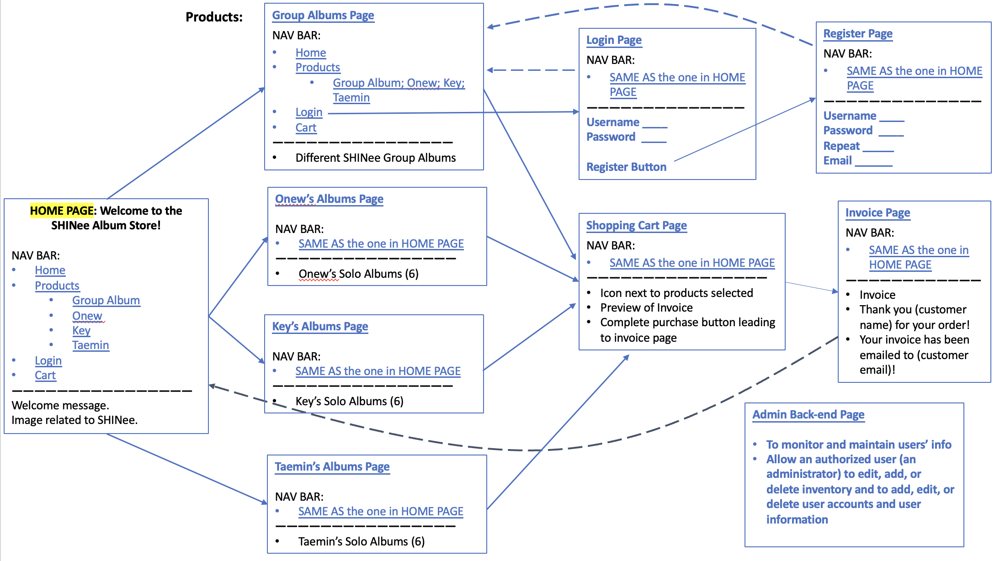

### 1. Show what each page will look like. The pages do not have to be “functional” but the design should be clear.
Click [HERE](https://youtu.be/-HfROd5kg0w) to view a screencast presentation covering the design of the site.

#### Plan for Site

 

### 2. Describe your design for your site’s shopping cart. That is, will it be a separate page that the user can view and edit, or will it be integrated into the product pages? If so, describe in detail how this will work on your site. Provide several examples of using the cart.
We plan to have a separate page for the shopping cart where users can view and edit the quantities of the products that they had selected. It will look similar to the invoice page where users can preview the item and quantity before confirming the purchase. The cart will store the user's purchase information based on the data within the user’s session. Once the user selects a quantity for the product they want, they can add it to the cart. 

In the cart, users can edit the quantities of the item(s) that they selected, such as adding the quantity or removing the item completely. After they have confirmed their selection, they will press on a “Complete Purchase” button to proceed to the Invoice page. Before users can proceed to the invoice page, they must login or register an account. If they are not logged in, they will be directed to the login page.

### 3. Explain specifically how you will use sessions to manage your shopping cart. In particular, what shopping cart data will be stored in the session, what data format will be used (NOT what data type, but the format like with the data format used for your registration data). Use code examples showing what data structures (such as arrays and their objects) you will use to manage the shopping cart data and how they will be used in a session.
We plan to utilize sessions to manage our shopping cart information and to store quantity inputted data. It will be the value of the product type key for each of the products that will be stored in the shopping cart in an array format. If a user selects products from multiple pages, it will be put into an array that looks similar to this: {Atlantis: [1. 2. 3], Everybody: [4, 5, 6]}.

### 4. How will you avoid access to your application when the user has not logged in or registered? What are the particular security concerns you must address?
We plan to avoid users from accessing our application through the use of cookies. When a user purchases an item through the shopping cart, the server will check if the user has a cookie. If the user has a cookie, then they will be directed to the invoice page, however, if they do not have a cookie then they will be directed to the login page or have the option to register if they do not already have an account. A particular security concern is that cookies can be accessed and modified.

### 5. Upon a successful login, how do you provide personalization in your UI? Explain how you did or will do this (paste code if necessary)
Upon a successful login, we plan to personalize our invoice page by including the email address that is associated with the username in the invoice message. We are still in the process of planning out all of the personalizations that we will be implementing upon a successful login. All in all, to get the email address, we plan to get it from the user_data.json that is stored in the cookie in the login.

### 6. If you are working with partners, how will you split up the work in your team so that you are working in parallel as effectively as possible? That is, who is doing what and when?
Yes, I will be working with partners. We plan to work cohesively on one task at a time so that we work to consistently be on the same page and can understand what each of us are thinking and planning to do. This will hopefully minimize the amount of time that we must spend figuring out how each of our parts of code that we would have been working on separately work together. By working together on one task at a time, we spend more time and all of our knowledge focused on that task rather than being scattered around. We plan to spend at minimum, 2 hours a day working together. If either of us figure something out when we are not together, we plan to relay the information to each other so that we are all on the same page and can pick up where that person left off.

### 7. How are you approaching Assignment 3 differently than Assignment 2?
We are approaching Assignment 3 differently than Assignment 2 in that, this time around, we have a prototype constructed for our reference, and we are working on planning our steps to completion prior to writing out code. We recognize that there are a lot more tasks to complete for this assignment and planning accordingly. We are taking more time to think of an efficient plan and create a design prior to writing out code. This will hopefully reduce our levels of stress when it comes time to write out code. 
